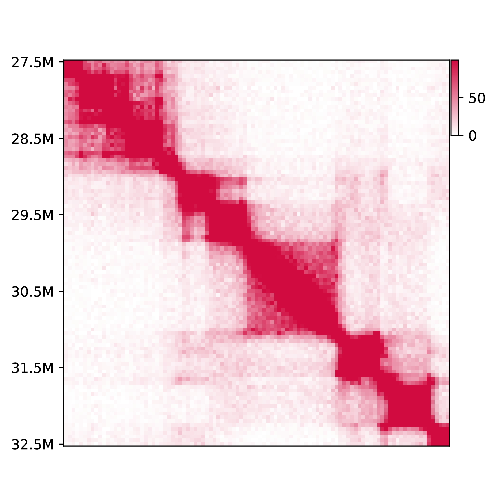
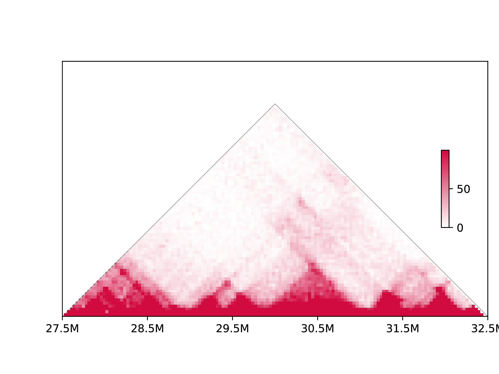
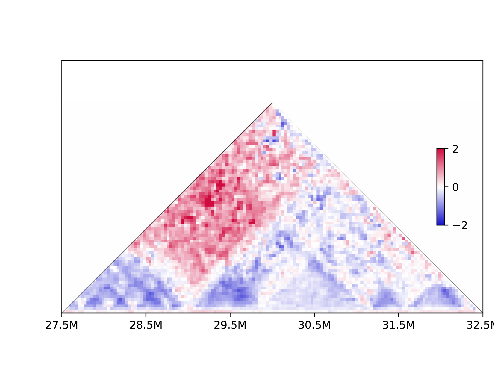

# 7. Provide basic functions to visualize and handle Hi-C data

``` 
$ h1d basic
usage: __main__.py basic [-h] [-o OUTNAME] [-c CONTROLMATRIX]
                         [--datatype DATATYPE] [--gt GT] [--plottype PLOTTYPE]
                         [-s START] [-e END] [--normalize NORMALIZE]
                         mode data resolution chromosome
```

- `mode`, Running mode,,should be one of {plot,dump}

- `data`, Path of matrix file or raw .hic file.
- `resolution`, resolution (50000, i.e.) of given contact matrix, or choosed resolution for analyzing `.hic` file.
- `chromosome`, selected chromosome to be analyzed.
- `--datatype`, type of input data: "matrix" (default) or "rawhic".
- `--gt`, [genome table file](https://h1d.readthedocs.io/en/latest/overview.html#input-format) when using raw .hic data.
- `-o`,  output name, default: unname

## 7.1 Plot indicated region

This function provide basic visualization for Hi-C data.

- `--plottype`, Type of plot, could be one of {tri,square,tad}
- `-s`, start site for plot.
- `-e`, end site for plot.
- `-c`, File of control sample. If provided, it will plot differential matrix of treat_vs_control.

``` shell
h1d basic plot ./test_data/GSE104334_Ctrl.chr21.matrix.gz \
	50000 chr21 --datatype matrix -o testplot --plottype square \
	-s 27500000 -e 32500000
```



If use `--plottype tri`:



Differential matrix is plotted when the control data is provided:

```shell
h1d basic plot ./test_data/GSE104334_Ctrl.chr21.matrix.gz \
	50000 chr21 --datatype matrix -o testplot --plottype square \
	-s 27500000 -e 32500000
```



## 7.2 Make contact matrix.

`--normalize`, Normalize methods {NONE/VC/VC_SQRT/KR}

```
h1d basic dump ./test_data/GSE104334_Ctrl.hic 50000 chr21 \
	--datatype rawhic -o testdump --gt ./test_data/hg19_genome_table.txt
	--normalize KR
```

The output will be:

```
testdump
└── 50000
    └── observed.KR.chr21.matrix.gz
```

which is dense matrix (zipped) of intra-chromosomal contacts, like:

|       |  0   | 25000 | 50000 | 75000 | ...  |
| :---: | :--: | :---: | :---: | :---: | ---- |
|   0   |  0   |   0   |   0   |   0   | ...  |
| 25000 |  0   |   8   |   3   |   5   | ...  |
| 50000 |  0   |   3   |   8   |   4   | ...  |
| 75000 |  0   |   5   |   4   |   0   | ...  |
|  ...  | ...  |  ...  |  ...  |  ...  | ...  |

 

### Dump all chromosomes

- `chromosome` , set chromosome to "all" will compute metrics for all chromosomes.
- `data`, must be `.hic` data
- `-maxchr`, Maximum index of chromosome (human genome is 22,i.e.). It will compute chromosome 1~maxchr plus chromosome X.
- `-n`, Number of processors

``` shell
h1d basic dump ./test_data/GSE104334_Ctrl.hic 50000 all \
	--gt ./test_data/hg19_genome_table.txt --normalize KR -o justtest \
	--datatype rawhic --maxchr 22 -n 30
```

Output would be:

```
justtest
└── 50000
    ├── observed.KR.chr1.matrix.gz
    ├── observed.KR.chr10.matrix.gz
    ├── observed.KR.chr11.matrix.gz
    ├── observed.KR.chr12.matrix.gz
    ├── observed.KR.chr13.matrix.gz
    ├── observed.KR.chr14.matrix.gz
    ├── observed.KR.chr15.matrix.gz
    ├── observed.KR.chr16.matrix.gz
    ├── observed.KR.chr17.matrix.gz
    ├── observed.KR.chr18.matrix.gz
    ├── observed.KR.chr19.matrix.gz
    ├── observed.KR.chr2.matrix.gz
    ├── observed.KR.chr20.matrix.gz
    ├── observed.KR.chr21.matrix.gz
    ├── observed.KR.chr22.matrix.gz
    ├── observed.KR.chr3.matrix.gz
    ├── observed.KR.chr4.matrix.gz
    ├── observed.KR.chr5.matrix.gz
    ├── observed.KR.chr6.matrix.gz
    ├── observed.KR.chr7.matrix.gz
    ├── observed.KR.chr8.matrix.gz
    ├── observed.KR.chr9.matrix.gz
    └── observed.KR.chrX.matrix.gz
```

## 7.3 Make gene density file for PC1

```shell
h1d basic gd refFlat.hg19.txt 50000 \
		./test_data/hg19_genome_table.txt -o hg19.geneDensity.txt
```

- `refFlat.hg19.txt` is defined by [UCSC](http://www.nodai-genome.org/btau/cgi-bin/hgTables?hgsid=5165&hgta_doSchemaDb=bosTau4&hgta_doSchemaTable=refFlat) and should be at least 6 columns as (without 1st row):

  | **geneName** | name         | chrom | strand | txStart | txEnd  |
  | ------------ | ------------ | ----- | ------ | ------- | ------ |
  | RCAN1        | NM_001034679 | chr1  | +      | 327876  | 339078 |
  | KCNE1        | NM_001077977 | chr1  | +      | 377375  | 383871 |
  | ...          | ...          | ..    | ...    | ...     | ...    |

- `50000` is the resolution for PC1 analysis.

- `./test_data/hg19_genome_table.txt` is genome table file (tab-separated)  which described the length of each chromosome for your genome reference:

  | chr1 | 248956422 |
  | ---- | --------- |
  | chr2 | 242193529 |
  | ...  | ...       |

- `-o` is the output name 