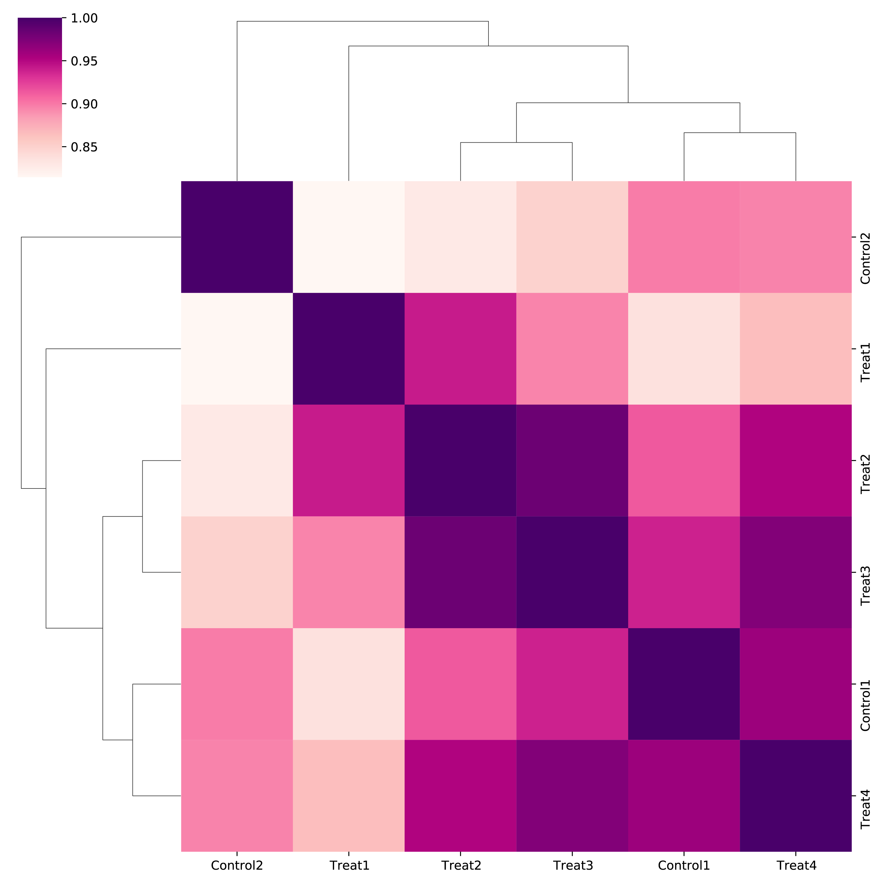
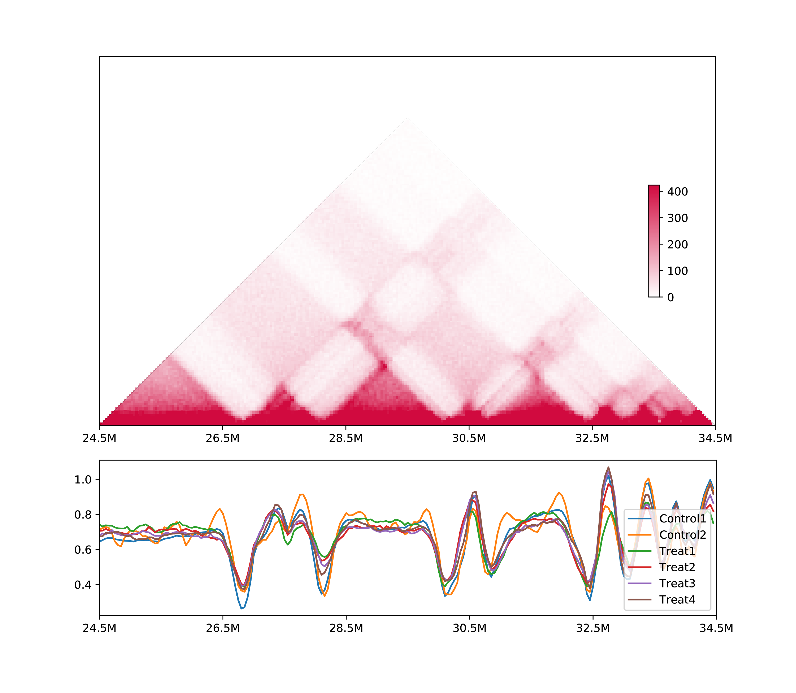
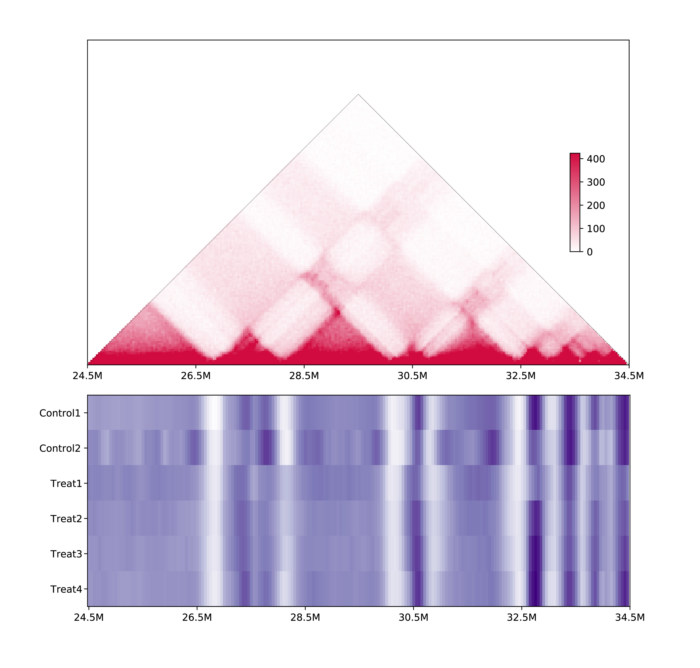
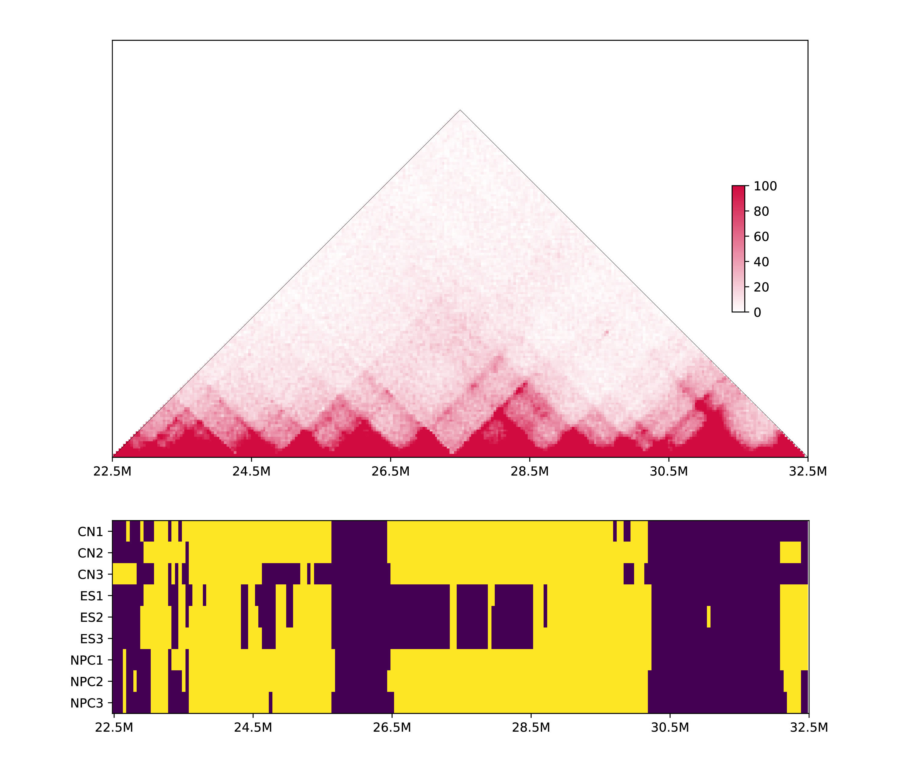

# 5. Obtain the same metrics for muliple samples

## 5.1 Calculation

```
h1d multisamples IS test.txt 50000 chr21 -o multisamples_metrics
```

The output would be `multisamples_metrics.csv`:

| chr   | start    | end      | Control1 | Control2 | Treat1   | Treat2   | ...  |
| ----- | -------- | -------- | -------- | -------- | -------- | -------- | ---- |
| ...   | ...      | ...      | ...      | ...      | ...      | ...      | ...  |
| chr21 | 23900000 | 23950000 | 0.600162 | 0.658727 | 0.734661 | 0.692226 | ...  |
| chr21 | 23950000 | 24000000 | 0.610387 | 0.674535 | 0.721764 | 0.70977  | ...  |
| ...   | ...      | ...      | ...      | ...      | ...      | ...      | ...  |

## 5.2 Parameters

```
$ h1d multisamples
usage: h1d multisamples [-h] [--datatype DATATYPE]
                        [--samplelist SAMPLELIST] [--labels LABELS]
                        [-p PARAMETER] [-o OUTNAME] [--gt GT] [--corr]
                        [--heat] [--line] [--anova] [--discrete] [-s START] [-e END]
                        type data resolution chromosome
```

### Required parameters:

- `type`, type of 1D metrics could be one of {IS,CI,DI,SS,DLR,PC1,IES,IAS,IF}, as [described](https://h1d.readthedocs.io/en/latest/onesample.html#usage)

- `data`, a tsv (Tab-separated) file contain name and paths for all samples (below). Used file could be contact matrix or raw `.hic` as introduced [here](https://h1d.readthedocs.io/en/latest/overview.html#input-format) 

  | Control1 | ./testdata/Control1/observed.KR.chr21.matrix.gz |
  | -------- | ----------------------------------------------- |
  | Control1 | ./testdata/Control2/observed.KR.chr21.matrix.gz |
  | Treat1   | ./testdata/Treat1/observed.KR.chr21.matrix.gz   |
  | Treat2   | ./testdata/Treat2/observed.KR.chr21.matrix.gz   |
  | Treat3   | ./testdata/Treat3/observed.KR.chr21.matrix.gz   |
  | Treat4   | ./testdata/Treat4/observed.KR.chr21.matrix.gz   |

- `resolution`, resolution (50000, i.e.) of given contact matrix, or choosed resolution for analyzing `.hic` file.
- `chromosome`, selected chromosome to be analyzed.

### Optional parameters:

- `--datatype`, type of input data: "matrix" (default) or "rawhic".
- `-p`, parameters  for [one-sample](https://h1d.readthedocs.io/en/latest/onesample.html#usage)  metrics.
- `-o`,  output name, default: multisamples_metrics
- `--gt`, [genome table file](https://h1d.readthedocs.io/en/latest/overview.html#input-format) when using raw .hic data.


## 5.3 Visualization

- `--corr`, Plot correlation for all samples.
- `--heat`, Plot raw heatmap for all samples.
- `--line`, Plot line chart for all samples.
- `-s`, start site of plot when using `--corr` and `--line`.
- `-e`, end site of plot when using `--corr` and `--line`.

### 5.3.1 Correlation map of all samples

```shell
h1d multisamples IS test.txt 50000 chr21 \
	-o multisamples_metrics --corr
```



### 5.3.2 Line chart or multiple samples:

```shell
h1d multisamples IS test.txt 50000 chr21 -o multisamples_metrics \
	--line -s 24500000 -e 34500000
```



### 5.3.3 Heatmap or multiple samples:

```shell
h1d multisamples IS test.txt 50000 chr21 -o multisamples_metrics \
	--heat -s 24500000 -e 34500000
```



### 5.3.4 Discrete heatmap

Some metrics such as PC1, can not be quantitatively compared, thus we convert it to discrete value to draw a heatmap:

```shell
h1d multisamples PC1 test2.txt 50000 chr19 -o multisamples_metrics \
	--discrete -s 22500000 -e 32500000 -p mm10_geneDensity50000.txt
```



<<<<<<< HEAD
=======


>>>>>>> f18f222445dfb9fc325ad35e2fd278a2b63a6c89
## 5.4 Statistically comparison

As we mentioned in the manuscript, most of (except PC1 and DI) 1D metrics could be quantitatively compared. Considering most of them exhibited the unimodal distribution without obvious skew, we use ANOVA-like test to statistically compare multiple Hi-C samples. Each bin and its surrounding bins (default=2) are considered to to run such test. The obtained p-values is then adjusted via Benjamini/Hochberg method, to get the qvalue. 

To run this, please specify a genomic region and type:

```shell
python -m h1d multisamples IS test.txt 50000 chr21 -o ptest --anova -s 24500000 -e 34500000
```

, where the `test.txt` is described above. The out put will be:

| chr   | start    | end      | pvalue                 | qvalue                |
| ----- | -------- | -------- | ---------------------- | --------------------- |
| ...   | ...      | ...      | ...                    | ...                   |
| chr21 | 24650000 | 24700000 | 1.4207106516019808e-05 | 5.25394882479223e-05  |
| chr21 | 24700000 | 24750000 | 0.000600635194484068   | 0.0014715562264859666 |
| chr21 | 24750000 | 24800000 | 0.00011666149851486222 | 0.0003412784135658656 |
| ...   | ...      | ...      | ...                    | ...                   |

