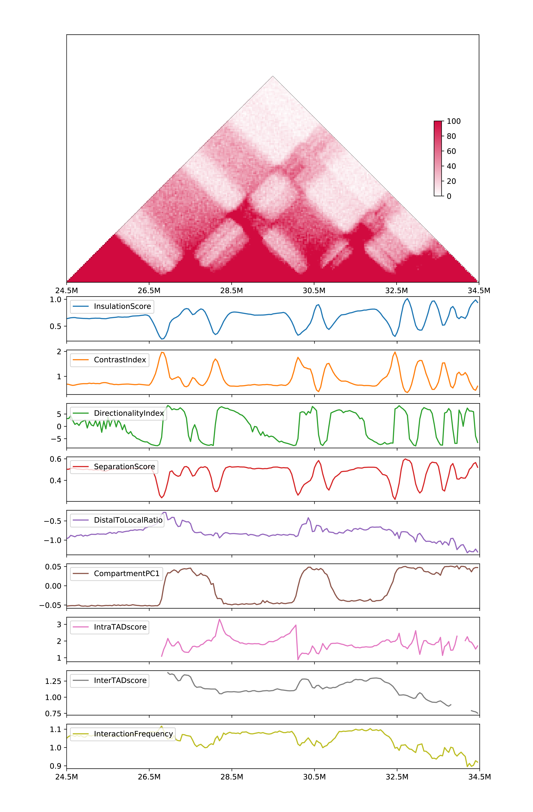
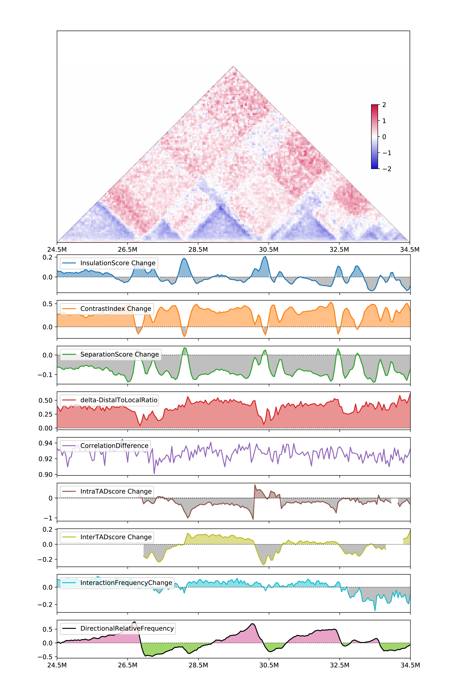

# 6. Obtain various types of 1D metrics for the same sample

## 6.1 Calculation

``` shell
# dense matrix
h1d multitypes IS,CI,DI \
	./test_data/GSE104334_Ctrl.chr21.matrix.gz \
	50000 chr21 -p 300000,300000,1000000 \
	--datatype matrix -o multi_types_metric
	
# .hic input
h1d multitypes IS,CI,DI \
	./test_data/GSE104334_Ctrl.hic  \
	50000 chr21 -p 300000,300000,1000000 \
	--datatype rawhic -o multi_types_metric --gt ./test_data/hg19_genome_table.txt 

# .cool input
h1d multitypes IS,CI,DI \
	./test_data/GSE104334_Ctrl.50000.cool  \
	50000 chr21 -p 300000,300000,1000000 \
	--datatype cool -o multi_types_metric --gt ./test_data/hg19_genome_table.txt 
```

This will output a csv file `multi_types_metric.csv` like：

| chr   | start    | end      | InsulationScore | ContrastIndex | DirectionalityIndex |
| ----- | -------- | -------- | --------------- | ------------- | ------------------- |
| ...   | ...      | ...      | ...             | ...           | ...                 |
| chr21 | 23900000 | 23950000 | 0.652077        | 0.667196      | -3.776812           |
| chr21 | 23950000 | 24000000 | 0.636362        | 0.678699      | -3.448456           |
| ...   | ...      | ...      | ...             | ...           | ...                 |

## 6.2 Parameters

``` 
$ h1d multitypes
usage: h1d multitypes [-h] -p PARAMETER [-c CONTROLMATRIX]
                      [-o OUTNAME] [--datatype DATATYPE] [--gt GT]
                      [-d] [-s START] [-e END]
                      typelist data resolution chromosome
```

- **Required parameters**:
  - `typelist` the list of types separated by comma. 
    - When calculating one-sample metrics, it should be subset of [IS,CI,DI,SS,DLR,PC1,IES,IAS,IF]. 
    - When calculating two-sample metrics, it should be subset of [ISC,CIC,SSC,deltaDLR,CD,IESC,IASC,IFC,DRF]
  - `data`, Path of matrix file or raw `.hic` file 
  - `resolution`, resolution (50000, i.e.) of given contact matrix, or choosed resolution for `.hic` file
  - `chromosome`, selected chromosome to be analyzed.
  - `-p`, list of parameters (comma-separated). Please refer to [one-sample](https://h1d.readthedocs.io/en/latest/onesample.html#usage) or [two-sample](https://h1d.readthedocs.io/en/latest/twosample.html#usage) metrics.
- **Optional parameters**:
  - `-o`, output name, default: multitypes_metrics
  - `-c`, contact matrix or .hic file of control sample, which is required when calculating two-sample metrics.
  -  `--datatype`, type of input data: "matrix" (default) or "rawhic".
  - `--gt`, [genome table file](https://h1d.readthedocs.io/en/latest/overview.html#input-format) when using raw .hic data.

## 6.3 Visuliazation

`-d`, decide whether to plot.

`-s`, start site for plot.

`-e`, end site for plot.

- Visulize one-sample metrics (output will be `all_onesample.csv` and `all_onesample.pdf`)

``` shell
h1d multitypes IS,CI,DI,SS,DLR,PC1,IAS,IES,IF \
	./test_data/GSE104334_Ctrl.hic 50000 chr21 
	-p 300000,300000,1000000,300000,3000000,./test_data/hg19_geneDensity50000.txt,300000,300000,0.05 
	--datatype rawhic --gt ./test_data/hg19_genome_table.txt 
	-o all_onesample -d -s 24500000 -e 34500000
```



- Visulize two-sample metrics: (output will be `all_twosample.csv` and `all_twosample.pdf`)

``` shell
h1d multitypes ISC,CIC,SSC,deltaDLR,CD,IASC,IESC,IFC,DRF \
	./test_data/GSE104334_Rad21KD.hic 50000 chr21 \
	-c ./test_data/GSE104334_Ctrl.hic
	-p 300000,300000,300000,3000000,pearson,300000,300000,0.05,200000-5000000 \ 
	--datatype rawhic --gt ../test_data/hg19_genome_table.txt \
	-o all_twosample -d -s 24500000 -e 34500000
```

