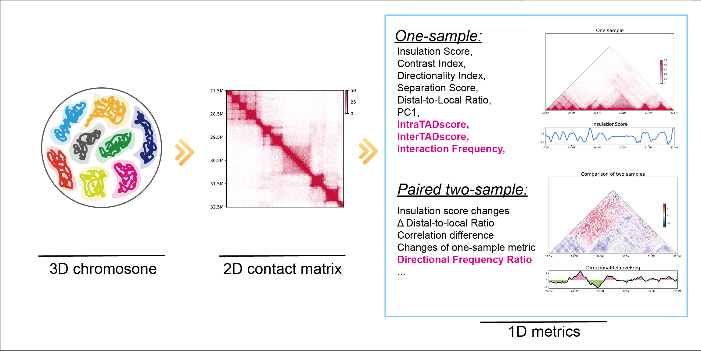

# 1. Overview and Installation

## 1.1 Introduction

We presented “HiC1Dmetrics”, a pipeline that are able to calculate and analysis one-dimensional (1D) metrics for Hi-C data. HiC1Dmetrics is a Python3-based program (<https://github.com/wangjk321/HiC1Dmetrics>) and provide command line interface for UNIX system. 



## 1.2 Installation

HiC1Dmetrics were released on PyPI, and could be accessed by:

``` python
pip3 install h1d
```

After installation, try:

```
$ h1d -V
h1d version 0.0.21
```


## 1.3 Requirements

HiC1Dmetrics is based on python3 and it requires:

- Python (>= 3.6) packages:
  - pandas
  - numpy
  - scipy
  - scikit-learn
  - statsmodels
  - matplotlib
  - seaborn
  - fithic==2.0.7
  - multiprocess
  - cooler == 0.8.2
- Others: 
  - bedtools >= 2.29.2

All required python packages will be automatically installed when use `pip install h1d`

## 1.4 Test file

In this tutorial, we prepared servel files for test. **All results in this tutorial can be reproduced using test data**. We mainly used the data from GSE104334.

- Zipped intra-chromosomal contacts (can be find in the ./test_data/ of GitHub page)

  - GSE104334_Ctrl.chr21.matrix.gz
  - GSE104334_Rad21KD.chr21.matrix.gz

- Hi-C file in .hic (Juicer) format (the download link is in ./test_data/ of GitHub page)

  - GSE104334_Ctrl.hic
  - GSE104334_Rad21KD.hic

- Hi-C file in .cool (Cooler) format (the download link is in ./test_data/ of GitHub page)

  - GSE104334_Ctrl.cool
  - GSE104334_Rad21KD.cool

- Two folder for the test of multisamples as described [here](https://h1d.readthedocs.io/en/latest/multisample.html):

  - multisample1
  - multisample2

- Other files that support the test:

  - hg19_genome_table.txt

  - hg19_geneDensity50000.txt

    

## 1.5 Input format

HiC1Dmetrics support:

- raw `.hic` defined by [juicer](https://github.com/aidenlab/juicer/wiki) software.

- OR raw `cool` defined by cooler software

- OR dense matrix (raw or zipped) of intra-chromosomal contacts, like:

  |       |  0   | 25000 | 50000 | 75000 | ...  |
  | :---: | :--: | :---: | :---: | :---: | ---- |
  |   0   |  0   |   0   |   0   |   0   | ...  |
  | 25000 |  0   |   8   |   3   |   5   | ...  |
  | 50000 |  0   |   3   |   8   |   4   | ...  |
  | 75000 |  0   |   5   |   4   |   0   | ...  |
  |  ...  | ...  |  ...  |  ...  |  ...  | ...  |

**Note 1:** when use `.hic` file, a genome table file (tab-separated) must be prepared, which described the length of each chromosome for your genome reference: 

| chr1 | 248956422 |
| ---- | --------- |
| chr2 | 242193529 |
| ...  | ...       |

**Note 2:** Calculation of Interaction Frequency (IF) can only accept raw `.hic` file

## 1.6 Overall usage

The function of HiC1Dmetrics include serveral sub-command:

```
$ h1d -h
positional arguments:
  {basic,one,two,multitypes,multisamples,call}
                        Choose the mode to use sub-commands
    basic               Provide basic functions to visualize and handle Hi-C
                        data.
    one                 1D metrics designed for one Hi-C sample
    two                 1D metrics designed for comparison of two Hi-C samples
    multitypes          Various types of 1D metrics for the same sample
    multisamples        The same metrics for muliple samples
    call                Extract secondary information from metrics (dTAD,
                        stripeTAD, et.al)
```

In the next section, we mainly use a high-resolution Hi-C data by Rao et,al. ([GSE104334](https://www.ncbi.nlm.nih.gov/geo/query/acc.cgi?acc=GSE104334)) to make this tutorial

